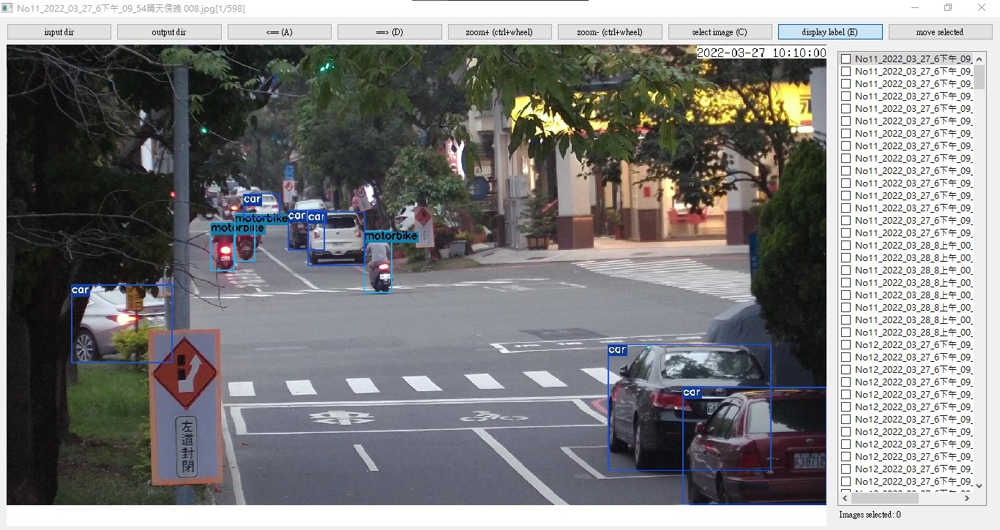

## Getting Started

Python version == 3.7.5

```
git clone https://github.com/ZachKLYeh/Annotation_Selector.git
```
```
cd Annotation_Selector
```
```
python main.py
```

## When to use?

One way of annotation is to train the model on small annotated dataset

Then utilize the model to predict some unlabeled images

Then pick the mispredicted images for annotation

The application is to fasten this behavior

By helping annotator to view the prediction of the model and select wrong prediction for futher annotation

## How to use?



### Select input and output folder:

The application will read input folder and get image/annotation pairs. According to file name.

Xml format and txt(yolo) format are supported.

The input folder structure shoud be like this:(xml format visualization)

|-- input foler

|   |-- img1.jpg

|   |-- img1.xml

|   ˋ-- ...

Or like this:(txt format visualization)

|-- input foler

|   |-- img1.jpg

|   |-- img1.txt

|   ˋ-- ...

Or like this:(txt format visualization)

|-- input foler

|   |--labels

|      |-- img1.txt

|      |-- img2.txt

|      ˋ-- ...

|   |-- img1.jpg

|   |-- img2.jpg

|   ˋ-- ...


### Key Pressed Event

* Press A for previous image

* Press D for next image

* Press ctrl + mouse scroll to zoom in/zoom out

* Press C to select/unselect an image

* Press E to display/hide object classes

### Move selected

When you pressed the "move selected" button

The application will move all the selected image/annotation pair to output folder.

Note: We are only moving xml format annotation

Then you can edit them via LabelImg
